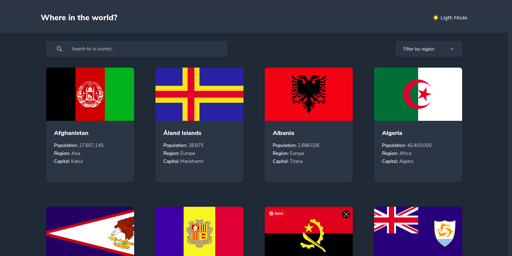
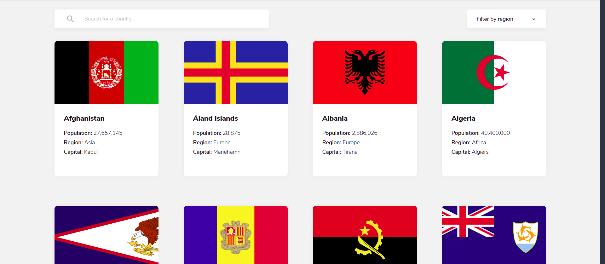
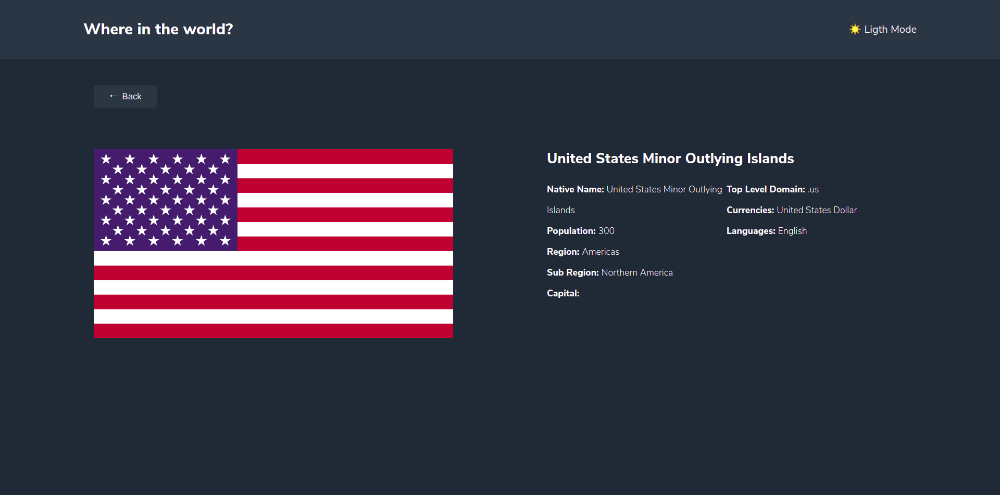

# Frontend Mentor - REST Countries API with color theme switcher solution

This is a solution to the [REST Countries API with color theme switcher challenge on Frontend Mentor](https://www.frontendmentor.io/challenges/rest-countries-api-with-color-theme-switcher-5cacc469fec04111f7b848ca). Frontend Mentor challenges help you improve your coding skills by building realistic projects.

## Overview

### The challenge

Your challenge is to integrate with the [REST Countries API](https://restcountries.eu) to pull country data and display it like in the designs.

You can use any JavaScript framework/library on the front-end such as [React](https://reactjs.org) or [Vue](https://vuejs.org). You also have complete control over which packages you use to do things like make HTTP requests or style your project.

Users should be able to:

- See all countries from the API on the homepage
- Search for a country using an `input` field
- Filter countries by region
- Click on a country to see more detailed information on a separate page
- Click through to the border countries on the detail page
- Toggle the color scheme between light and dark mode _(optional)_

### Screenshot

 

 

### Links

- Solution URL: [repo](https://github.com/AlecANL/country-app)
- Live Site URL: [live demo](https://countries-react-app.vercel.app/)

## My process

### Built with

- Semantic HTML5 markup
- CSS custom properties
- Flexbox
- CSS Grid
- Mobile-first workflow
- [React](https://reactjs.org/) - JS library
- Redux

## Author

- Website - [alec's portfolio](https://alec-portfolio-dev.vercel.app/)
- Frontend Mentor - [@yourusername](https://www.frontendmentor.io/profile/AlecANL)
- Twitter - [@alexei_alvarez4](https://www.twitter.com/alexei_alvarez4)
